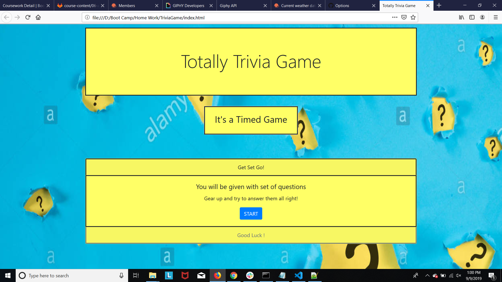

# Trivia Game

## Site pictures


## Technologies Used
- HTML : used to create elements on the DOM
- Bootstrap  : Styles html elements on page
- Javascript : used to provide interative effects
- JQuery : event handling, DOM manipulation
- Git : version control system to track changes to source code
- GitHub : hosts repository that can be deployed to GitHub pages

## Summary
### It's a quiz game. You will have 10 timed questions. You will be shown correct answers when answered incorrectly. Review your total score at the end and restart the game.

## Code Snippet
```Javascript

    // **************************************
    // This code snippet evaluates the answer 
    // **************************************
    function evaluate(answer){
        $("#answer").removeClass('d-none');
        $("#answer").show();
        if(answer == ansBank[index]){
            console.log("Answer inside equal if loop : "+answer);
            console.log("Inside equal if loop: "+ansBank[index]+"value of i is : "+i);
            // $(answer).addClass("active");
            $("#answer").html("<p>Yay! Correct answer</p>");
            console.log("inside equal if loop: "+answer);
            askQuestionsHide();
            stopTimer();
            // scoreCard();
            score = score + 1;
            correctAnswers++;
            i++;
            //Breaks the loop if all questions in array were asked
            ifAllQuestionsAsked();
        }
```


## Author Links
[LinkedIn](https://www.linkedin.com/in/mahisha-gunasekaran-0a780a88/)

[GitHub](https://github.com/Mahi-Mani)

